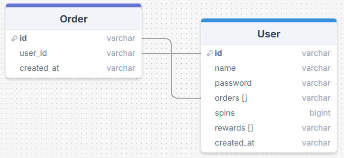

# Sales reward spinner

### Assignment
The salesperson should be able to view the number of available spins, perform a spin, and see the history of previous spins.

There must be an endpoint on the backend as described below, to simulate an incoming order.
This endpoint is responsible for assigning a spin to the corresponding user.
```
POST /order {
  order_id: string,
  user_id: string,
  created_at: string
}
```
The technical requirement is to use TypeScript and Node.js.
For the frontend, you may use any framework you prefer or vanilla JavaScript.
On the backend, you're free to use any framework and any database.

### Solution
We are going with a set of five rewards, which the company will be able to dynamically be able to choose rewards. We have set different probabilities for each slot.  
  
So when the user spins the wheel the code randomly chooses a number, the reward in the slot that the number belongs to will be saved into the users rewards list. 

## Tech
Fastify, Typescript, Node.js, MongoDB

## ER diagram 


## Endpoints
GET '/'  
_returns a page where you can purchase from a specific user_  
POST '/user?user_id=:id  
_creates an order with a user_id and increments users spins with 1_  
POST '/user?user_id=:id  
_returns a page where the user can press "spin" and see previous rewards, when used it'll decrement spins column in user_  

#### Using insomnia
If using insomnia you can download this [yaml](./backend/public/Insomnia_2025-09-02.yaml) file and import it into your insomnia to use it and test the endpoints.

### Response
- ```message```: A message with users data
    + ```id```: Users id
    + ```name```: Users name
    + ```orders```: Array of order ids for users orders
    + ```spins```: Users total of unused spins
    + ```rewards```: Array of users previous rewards
    + ```reward```: Name of reward
    + ```created_at```: Date of creation

### Example
```
{
    message: "Fetch complete",
        user: {
            "_id": "689b0a279e34a7d4303d5223",
            "name": "Jonas",
            "orders": [
                "order_id": "689b0a279e34a7d4303d5223",
                "order_id": "689b0a279e34a7d4303d5224"
            ],
            "spins": 1,
            "rewards": [
                "reward": reward_one,
            ]
            "created_at": "2025-08-28T07:22:26.951+00:00"
        }
}
```
## Status codes
```201 Created```: Order created  
```400 Bad request```: Malformed or missing parameters  
```500 Internal Server Error```: User or order not found  
```404 Not found```: Page not found


## Team
        
[David](https://github.com/DavidDyberg), [Ida](https://github.com/Chokladglasyr) and [Elias](https://github.com/Elias-Larsson)